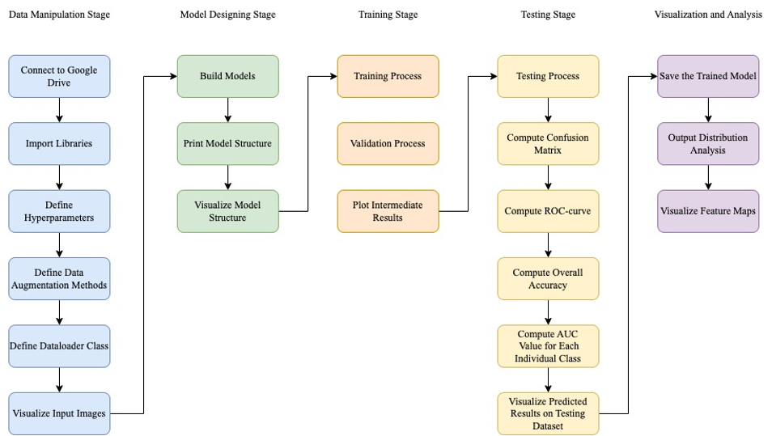
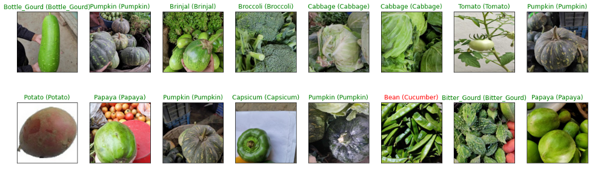
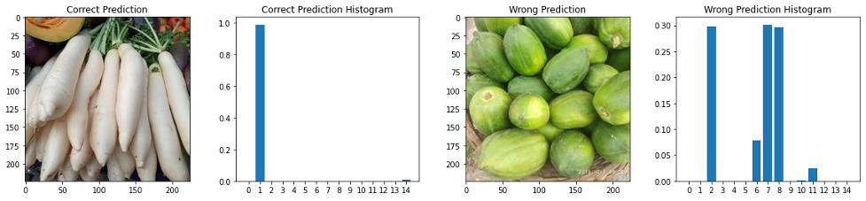

# Deep Learning - Automatic Vegetable Classification

## Description

Automatically identifying different types of vegetables is useful for both commodity trading and retail.

> This project aims to develop automatic vegetable classification models using deep learning for vegetable picking, sorting, and delivery.

- In this project, we first fine tune a baseline model using AlexNet.

- We then explore the ability of three advanced training techniques including data augmentation, regularization (dropout and batch normalization), and learning rate decay. 

- Finally, we evaluate transfer learning performance using pre-trained ResNet-18 and EfficientNet-B0 models and compare them with the baseline models.

## Deep Learning Pipleline

## Prediction Results Visualization

We plot the first 16 images of a batch of images in the test dataset. The first word in each title is the truth label. The word in the parentheses represents the predicted label of our model. The images with green titles indicate the correct prediction. The red titles represent the wrong predictions.

## Output Distribution Analysis

The outputs of our models are a set of probabilities that the current sample belongs to each category. During the evaluation, we choose one category with the largest probability as the sample’s label.

> As a result, we want to understand the probability distributions of correctly predicted samples and wrongly predicted samples.

The histograms of output probability distributions of correct prediction and wrong prediction are shown as follows.

The histograms give us the softmax probability to which the class the image belongs.

- For the correct prediction, the softmax probability of the true category is much higher than the probabilities of other categories.

- On the other hand, the wrong prediction has multiple softmax probabilities that have similar values.

## Analysis

- Our experiments show that that data augmentation, regularization, and learning rate decay are necessary when training deep neural networks because they can maintain the numerical stability of parameters in deep neural networks.

- Furthermore, our experiments prove that transfer learning is essential in the computer vision domain and can provide extremely good results. Our transfer learning models achieve 98.4% classification accuracy, which is better than the baseline models.

## References

- Ahmed, M. I., Mamun, S. M., & Asif, A. U. Z. (2021, May). DCNN-Based Vegetable Image Classification Using Transfer Learning: A Comparative Study. In 2021 5th International Conference on Computer, Communication and Signal Processing (ICCCSP) (pp. 235-243). IEEE.
